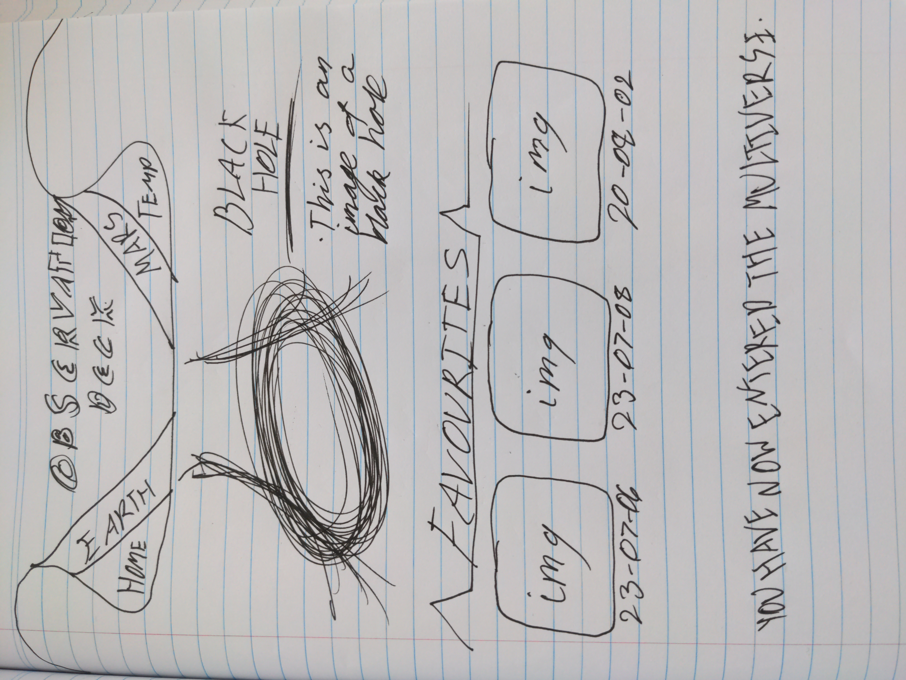

# Planet Observatory
Welcome to the Planet Observatory! This web application harnesses the power of NASA's API to fetch and display captivating images captured by the Mars rovers. As humanity explores the Red Planet, this project aims to provide a seamless and immersive experience for users to delve into the wonders of Mars through stunning imagery.

# Getting Started
1. Add your NASA API key into to the '.env' file,
2. Launch the project by running 'pnpm start'.

# Screenshots

# Technologies Used
- HTML
- CSS
- JavaScript
- React Vite

# Libraries Used
- react
- axios
- react-dom
- react-router-dom
- vite

# Features to Add
- Create a custom URL to have permanent and always-available access to this project
- Favourite images
- Fix the date and selector inputs to accurately display the images
- Make the user's experience better by only allowing you to choose dates that apply to the specific rover APIs rather than being a random guess
- Add Mars weather API
- Add location data for mars rovers
- Add better search feature to look for images by description using AI
- Add user accounts
- "Forgot password" button
- Add better font styles to match the theme of the site
- Add the option to add comments onto the images
- Add the option to rate particular images
- Allow the user to sort by 'highest rated' or 'highest favourites' to quickly find the most exciting images

# Why did I choose to use the NASA API and build my final GA project about the theme of a space observatory?
- I am a sci-fi lover and I have spent a large amount of time learning about different species of aliens as well as the ideology of mysticism :)

# Wireframes

